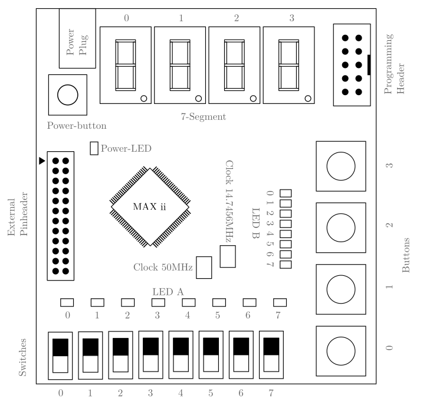

# MAXwel

MAX ii Workbench for Education and Learning - MAXwel

**This project is currently under heavy development: A working prototype was already made but the documentation is not up to date with the current version**

MAXwel is a cheap and simple FPGA development board made for educational purposes.
It is based in a low-cost Altera MAX ii Chip (EPM240), containing 240 logic elements, 8Kbits of RAM and 32Kbits of flash memory.
The board is equipped with 8 switches, 4 push-buttons, 16 LEDs (8 Red and 8 green) and 4 7-segment displays.
It also contains a 50MHz oscillator and a 14,7456 MHz oscillator as a clock source.
The board is programmed through a USB Blaster JTAG interface with the pin-header located on the board.

All schematics and PCB files are available in the `hardware` directory.

## Documentation and project template

[The user documentation is available in the `docs` directory](docs/main.pdf) and on the [landing page](https://mitchilaser.github.io/MAXwel/).

A [template for an empty VHDL project](template/vhdl) with correct pin assignments is available [in the `template` directory](template/).
The directory also contains a [template for a schematic based circuit design](template/schematic).
All templates are intended to be used with the [Quartus](https://fpgasoftware.intel.com/) software from Intel.

## TODO

This is just my personal list of TODO-Notes on this project. Maybe there is something for you to do as well :)

- update the docs (text + Landing-Page) to match the new pin-mapping
- Add a reverse polarity protection to the board
- Add holes to the board to attach a plexiglass cover
- Update the template projects to match the new pin mapping (7-Segments left)
- Create a list with the information of which part was ordered where. This is important for future reference and also for the documentation
- create some example projects and a "getting started" guide
- write own GUI application to draw circuits and call Quartus in the background for synthesis and upload (alternatively finalise the overlay). This UI needs to be better than the Quartus Software.

## What else?

There are also some features for hardcore enthusiasts.

### Overlay

**This project is currently under heavy development.**

The Overlay is an open FPGA architecture for open tools and user designs that is intended to run on the MAX ii chip, in essence an "FPGA on a FPGA".
The main goal of the Overlay is to provide a simple and easy to use platform for learning and experimenting with FPGA synthesis technology. 
Once the overlay is synthesizes and loaded into the MAX ii chip, it will be possible to load user designs into the overlay, without the need to re-synthesize the overlay itself.
This allows for a high level of flexibility and experimentation, as well as a way to learn about FPGA synthesis and design without the need for the closed source tools from the FPGA manufacturer.
Emulating an FPGA inside an FPGA takes up a lot of resources. Therefore the Overlay is not made for practical use cases outside of learning and experimentation.
